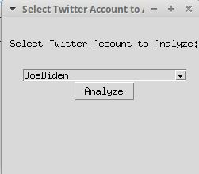
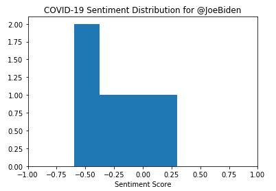
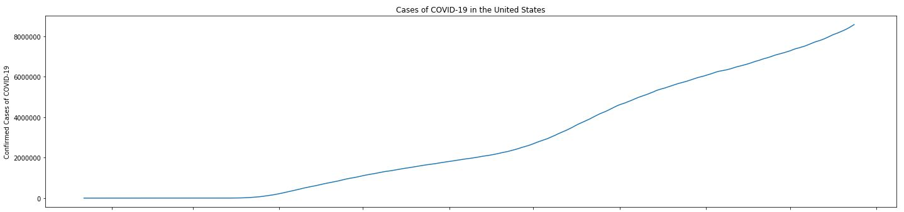
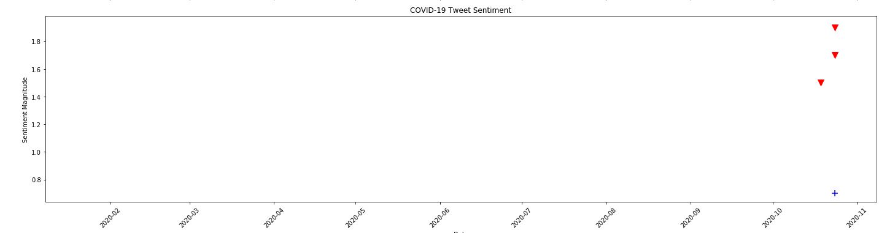

# EC601-Project02
The purpose of this project is to explore the Twitter API and Google Cloud Natural Language ("NLP") API. I have applied what I've learned to create a _COVID Correlator_ Social Media Analyzer.

# Table of Contents

Part I

1. [Securing API Keys](#Securing-API-Keys)
2. [Twitter API: Tweepy](#Twitter-API-Tweepy)
3. [Google NLP API](#Google-NLP-API)
4. [Future Direction](#Future-Direction)

Part II

5. [Product Mission](#Product-Mission)
6. [User Stories](#User-Stories)
7. [Software Implementation & Results](#Software-Implementation-Results)
8. [Next Steps](#Next-Steps)
9. [References](#References)

## Securing API Keys
There were a few options available to secure the API keys used in this demo. The most rudimentary method to _attempt_ to keep API keys secure is to remove them prior to pushing code to GitHub. This method is not at all technically challenging, but it's falliable and prone to human error; therefore, this method is not recommended [[1]](#1). In fact, this type of negligence is responsible for exposed keys in over 100,000 repositories with thousands of new instances every day [[2]](#2). Another potential method of securing API keys involves storing credentials in a separate file in the repository and adding that file to the .gitignore [[3]](#3). This is also a straightforward solution. However, Google best practices for securing API keys recommends that API keys should not be stored in files located inside the application's source tree [[4]](#4). Given these best practices and recommendations, I took a different approach.

My setup includes Conda to manage virtual environments. The Conda documentation includes a section on how to save environment variables [[5]](#5). I used this information to write a Bash script that activates environment variables containing my Twitter API key, API secret, access token, access token secret, and the JSON path to my Google application credentials every time I activate the project environment. A separate Bash script was written to deactivate these environment variables. This way, none of this sensitive information is included in the source code or source tree, and it is not at risk of being uploaded to a GitHub repository. In addition, this method makes it easy to share and collaborate if other contributors use the same nomenclature for their respective API keys and save their personal keys to their own environment variables.

## Twitter API: Tweepy
To verify that I set up the Bash scripts and Tweepy API correctly, I ran a modified "Hello Tweepy" example given in the Tweepy API Introduction [[6]](#6). The example successfully downloads 20 tweets from my 'Home' timeline and prints them to the console. I further modified this code to print my screen name, followers count, and friends list. Twitter also has a useful Cursor object that handles pagination, or the process of iterating through information. I experimented with the Cursor object by iterating through 5 statuses in my timeline.

I noticed that all of my tweets were truncated when printed. As it turns out, there have been changes to the number of allowable characters in certain circumstances over time, and the standard Tweepy API methods allow for a 'compact' or 'extended' parameter, which contains either a truncated or untruncated version of the tweets, respectively [[7]](#7). If the aim is to use information on Twitter for sentiment analysis, we want to ensure that we have the full context of each tweet to be used. Even when applying this initial fix, I noticed that certain tweets were still truncated. As it turns out, retweets must be handled separately with a try/except block, and the code for the handling of this section has been adapted from the Tweepy documentation on Extended Tweets [[7]](#7).

The most useful Tweepy method to gather tweets for sentiment analysis is likely API.search, which "returns a collection of relevant Tweets matching a specified query" [[8]](#8). This method takes a search query and returns search results, with additional parameters to restrict this search to different geographical regions, languages, and type of results (recent vs. popular). Tweepy requires several modifications to return the untruncated version of tweets, starting with the <code>extended_tweet</code> parameter. Then, to access the full tweets, I modified the aforementioned try/catch block for retweets to catch any _AttributeError_ and print the full tweet with the <code>full_text</code> key. This took trial and error, but I validated the results on various search queries in various languages.

Tweepy documentation mentions the <code>RateLimitError</code> exception, and I pre-emptively accounted for this potential issue by setting <code>wait_on_rate_limit</code> and <code>wait_on_rate_limit_notify</code> to True [[9]](#9).

To summarize the test programs, I was able to:

* Get the User object and associated screen name, followers count, and friends list
* Discover that the error message received when an incorrect Twitter handle is passed reads "tweepy.error.TweepError: [{'code': 50, 'message': 'User not found.'}]"
* Write code that catches the incorrect Twitter handle error and displays the message 'User handle <handle> does not exist.' (Can also be modified to request a new handle.)
* Retrieve tweets from my home timeline
* Retrieve tweets from a given Twitter handle
* Modify the number of tweets displayed, from how many pages, and whether the tweets should be truncated or not
* Use the Cursor object to process statuses (and catch Attribute errors)
* Search for specific query or hashtag, filter by language, timeframe, location, result type (recent or popular)
* Most importantly, I was able to retrieve tweets _in full_ according to my specifications, which will be useful for doing sentiment analysis for part 2 of this project
 

## Google NLP API
To set up the Google Natural Language API, I relied primarily on the official Google Cloud documentation [[10]](#10),[[11]](#11). To begin, I created a Cloud project and enabled the Google Cloud Language API. I activated the project environment, added credentials to the Bash script, and installed the Cloud Client Library Google Cloud Natural Language for Python. I ran a modified "Analyze some text" example from the NLP API Quickstart documentation and compared the result to the online NLP API demo tool [[12]](#12), [[13]](#13). The results indicated that my setup was working properly. One additional test of the API was performed using <code>analyze_entities</code> to see if entities (proper names and common nouns) were identified correctly throughout various text examples, and this test was also successful [[14]](#14).

To summarize the test programs, I was able to:

* Determine the sentiment score and magnitude of example sentences and verify the results using the online NLP API demo
* Interpret the sentiment score and magnitude values as being "clearly positive", "clearly negative", "neutral", or "mixed", recognizing that some thresholds might have to be adjusted based on the specific details of the application
* Perform entity analysis on a variety of example sentences and verify the results using the online NLP API demo
* Recognize the limitations of sentiment analysis, especially when there is nuanced language used to describe tragic events (this will be important if I do a project related to COVID-19, for instance)

## Future Direction
Now that I understand what an API is and how it works, as well as how to secure information like the API key and other credentials, I think my next step is to organize what I've learned into Python functions that can be called as part of a larger program for part 2 of this project. I am now thinking about the ways in which these APIs can be integrated in useful ways and the user impact that these different types of applications may have.

## Product Mission
For public affairs professionals, public health officials, and lobbyists who require quantitative data visualizations to understand how well official statements from elected officials reflect the underlying data, the _Covid Correlator_ is an innovative software that provides data visualizations and metrics of how well the Twitter activity of public officials and federal agencies correlates with COVID-19 infection rates across the United States. Unlike available academic solutions, our product is easy to use and publicly available to promote the free exchange of vital information in the midst of a global pandemic.

## User Stories
As an epidemiologist, I aim to understand the relationship between COVID-19 infection rates and the perception of official communications issued from the White House for my academic publications.

As a public health official, I need objective data at my disposal to provide testimony at legislative hearings to advocate for increased funding and resources to public health groups; this is especially vital to confront the challenges associated with the COVID-19 pandemic.

As the Director of the Division of Public Affairs at the U.S. Center for Disease Control and Prevention, my goal is to ensure that public CDC messaging remains strictly informative and neutral-positive in tone to reach the widest possible audience and influence the public health of the nation.

As a public affairs professional, I aim to organize a grassroots lobbying campaign motivated in part by the impact of the communications of elected officials on the dialogue surrounding COVID-19, and I'd like to motivate individuals to get involved on the basis of easy-to-interpret graphs and figures. 

## Software Implementation & Results
This software uses the Tweepy API, Google NLP API, and COVID19Py API to perform sentiment analysis on official tweets from elected officials and federal agencies and provides basic analysis and visualizations correlating sentiment data from COVID-related tweets with confirmed cases of COVID-19 in the United States. This gives us insight into political messaging and public affairs in light of objective data from the pandemic.

To use this app, run the code and follow the instructions on the pop-up window to select a Twitter account of interest. The app will perform sentiment analysis on the selected Twitter account on all tweets pertaining to coronavirus since the beginning of the COVID-19 pandemic. The output is twofold: (1) a histogram of the COVID-19 sentiment score distribution since the beginning of the pandemic; and (2) subplots showing a graph of confirmed COVID-19 cases in the United States over time (based on data from Johns Hopkins University as provided by the COVID19Py API) and a sentiment analysis scatter plot directly compared on the same time axis. For the subplot figure, COVID-19 cases over time are plotted as a continuous line, whereas the scatter plot of sentiments reveal the sentiment itself:

* A blue '+' indicates a 'positive' sentiment
* A red 'v' indicates a 'negative' sentiment

as well as the associated magnitude (height of the marker).

Because I chose to use Pandas dataframes to store the COVID-19 data and Twitter data, there were many unexpected challenges to overcome. I know Pandas is commonly used in data science applications, so I was motivated to try it out; however, when trying to generate the scatter plot, for instance, I couldn't pull data directly from the dataframe to plot. Instead, the data had to be read in as a list and all zipped together in order to properly plot the data as specified. Fortunately, the dataframes made certain actions easier, like using the apply/lambda structure to easily process data and store it as another column in the dataframe.

Another challenge I faced was in the plotting of the dates from the Pandas dataframe in Matplotlib. As it turns out, the Python <code>datetime</code> format conflicts with matplotlib's handling of plot axes [[16]](#16), so additional formatting was necessary to get the time axis to plot correctly on the subplots.

The (very basic) GUI is generated using the Tkinter GUI Toolkit [[15]](#15) and based off of an example using the Combobox widget [[17]](#17), which was then heavily modified to suit the purposes of this application. In the future, this UI could be modified to include the entire application on a single window; however, adding Matplotlib plots to the Tkinter GUI is non-trivial [[18]](#18) and I think this project would be better suited to a web app. This would allow for the tool to reach a wider audience, as well as provide a much easier way to produce a more elegant interface. Given the target audience, this would be a very important consideration: our goal is to reach a potentially non-technical audience, so providing an easy-to-use and easy-to-interpret web application would be very important to the success of the venture.

When performing the sentiment analysis, I had some very unique considerations while troubleshooting. Namely, I wasn't receiving many results when I tried to curate a collection of tweets from President Trump regarding COVID-19. I later realized that this was because I failed to include the term 'China virus' in my search query.

One limitation of this proof-of-concept is that I can only retrieve the past week's worth of Twitter data without the Premium API. See [Next Steps](#Next-Steps) for more details!

## Next Steps
Now that I have a functioning proof-of-concept for this idea, I'd like to make a few modifications and implement several new features going forward:

* I'd like to add a filter to the tweet preprocessing step to eliminate hyperlinks and maximize the amount of useful data being fed to the <code>sentiment_analysis</code> function.
* I plan to explore the use of more dynamic visualizations and more useful ways of displaying the data. Now that many of the challenges associated with cleaning, parsing, and processing are complete, this is the exciting next step.
* There are options to make this a real-time analysis app, which might provide additional insights into the data as well as added functionality.
* This analyzer would benefit from more sophisticated statistical analysis and a more robust COVID-19 data API.
* Further stratification of the data into region and analyzing Twitter data from local elected officials would be an ambitious goal in the future.
* I am interested in adding the option to limit analysis to a specified date range, or even to expand the application to include topics of wider political interest.
* Perhaps I would consider using a COVID-19 data API with more nuanced datasets; more information would allow the app to provide a more in-depth analysis.
* To take this project from proof of concept to fully-functional application, I would need access to the **Premium Twitter API** and **Full-Archive Search** to gain access to the full set of data (rather than just the past week's worth of tweets) [[19]](#19).
* Finally, this app would benefit from a beautiful and functional UI.

## References
<a id="1">[1]</a> https://developers.google.com/maps/api-key-best-practices

<a id="2">[2]</a> Meli, M., McNiece, M. R., & Reaves, B. (2019). How Bad Can It Git? Characterizing Secret Leakage in Public GitHub Repositories. In NDSS.

<a id="3">[3]</a> Blair. Message to BU EC601 \#class channel. _Slack_, 26 Sept. 2020.

<a id="4">[4]</a> https://cloud.google.com/docs/authentication/api-keys

<a id="5">[5]</a> https://docs.conda.io/projects/conda/en/latest/user-guide/tasks/manage-environments.html#windows

<a id="6">[6]</a> http://docs.tweepy.org/en/latest/getting_started.html

<a id="7">[7]</a> http://docs.tweepy.org/en/latest/extended_tweets.html

<a id="8">[8]</a> http://docs.tweepy.org/en/v3.5.0/api.html

<a id="9">[9]</a> http://docs.tweepy.org/en/v3.5.0/api.html#tweepy-error-exceptions

<a id="10">[10]</a>https://cloud.google.com/natural-language/docs/quickstart#quickstart-analyze-entities-gcloud

<a id="11">[11]</a> https://cloud.google.com/python/setup

<a id="12">[12]</a> https://cloud.google.com/natural-language/docs/quickstart-client-libraries#client-libraries-usage-python

<a id="13">[13]</a> https://cloud.google.com/natural-language

<a id="14">[14]</a> https://cloud.google.com/natural-language/docs/reference/rest

<a id="15">[15]</a> https://docs.python.org/3/library/tkinter.html

<a id="16">[16]</a> https://www.earthdatascience.org/courses/use-data-open-source-python/use-time-series-data-in-python/date-time-types-in-pandas-python

<a id="17">[17]</a> https://www.geeksforgeeks.org/combobox-widget-in-tkinter-python/#:~:text=Combobox%20is%20a%20combination%20of,the%20list%20of%20options%20displayed.

<a id="18">[18]</a> https://pythonprogramming.net/how-to-embed-matplotlib-graph-tkinter-gui/

<a id="19">[19]</a> https://techcrunch.com/2018/02/01/twitter-is-opening-up-its-full-archive-to-the-broader-developer-community/
